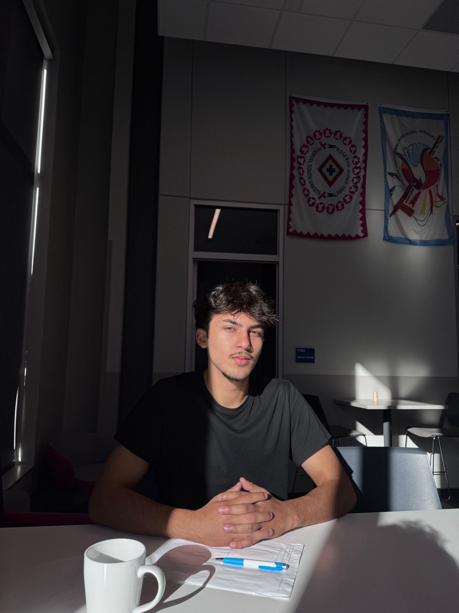

# Hi, I'm Aagat 👋

# 🎓  I am a Freshman at Dakota State University  
Major: Computer and informations system   
**Interests:** Cybersecurity, AI, Machine Learning, Networking

## 📄 Resume
[📥 Download my resume](./aagatresume.pdf)

## 🔧 Skills
- Python  
- Networking Basics (OSI, TCP/IP, VLAN, Routing, Wireshark)  
- Cybersecurity Fundamentals  
- Git & GitHub
- Online marketing 

---

## 🚀 Projects (More coming soon!)
- Intro Project (this one)
- Football AI Project (in progress)
- ISC2 Certified in Cybersecurity (CC) — studying now

---

## 📫 Contact
**Email:** aagat.adhikari@torjans.dsu.edu 
**LinkedIn:** https://www.linkedin.com/in/aagat-adhikari-a28144378 
